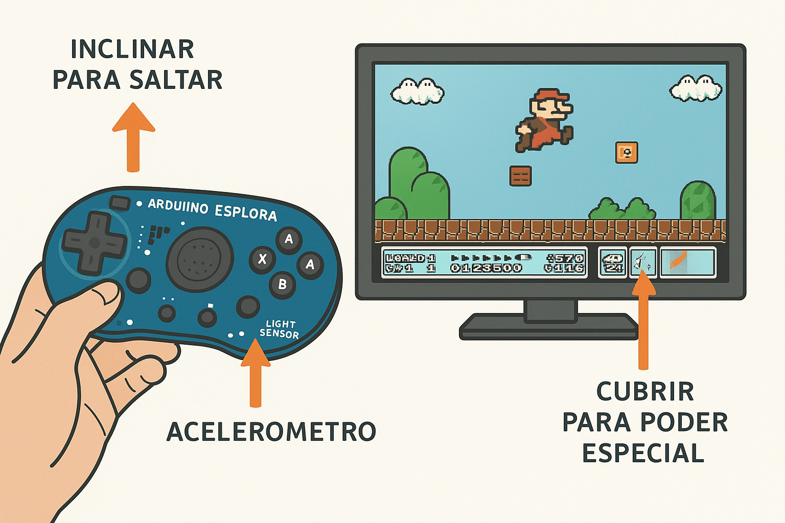

# 📄 Mario se mueve

# 📄 Product Requirements Document (PRD)

**Proyecto:** Super Mario Esplora Edition
**Componentes usados:** Acelerómetro, Sensor de Luz

## 1. Objetivo del Producto

Crear una versión minimalista de Mario Bros inspirada en el clásico, controlada exclusivamente por **movimiento físico** y **cambios de luz**, para demostrar las capacidades interactivas del Arduino Esplora de manera creativa y divertida.

## 2. Funcionalidades Clave

* **Movimiento con acelerómetro**: inclinar a la izquierda o derecha mueve a Mario en esa dirección.
* **Salto con acelerómetro**: sacudir hacia arriba activa el salto.
* **Poder especial con sensor de luz**: cubrir el sensor activa un modo especial (ejemplo: invencible, disparo, o turbo).
* **Juego minimalista**: gráficos simples en pantalla, con niveles cortos tipo autoscroller.

## 3. Requisitos Funcionales

* El sistema debe leer continuamente valores de **X\_AXIS** y **Y\_AXIS** del acelerómetro.
* El sistema debe detectar cambios bruscos en aceleración para registrar un **salto**.
* El sensor de luz debe tener un umbral configurable para activar/desactivar el poder especial.
* El juego debe responder a estas entradas en **tiempo real (<100ms de latencia)**.

## 4. Requisitos No Funcionales

* Interfaz clara y minimalista (sprites básicos).
* Juego estable y fluido (15–20 FPS en pantalla).
* Código modular y comentado para fácil mantenimiento.
* Bajo consumo energético, optimizado para uso prolongado.

## 5. Alcance y Limitaciones

* Solo se usan **acelerómetro** y **sensor de luz** como entradas.
* No se incluyen botones, joystick ni otros periféricos.
* Este PRD está diseñado como **prototipo demostrativo** y no como producto comercial.

